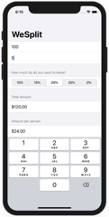

# 100-days-of-swiftui

Solutions to Paul Hudson's "100 days of SwiftUI" projects and challenges.

https://www.hackingwithswift.com/100/swiftui

## Completion status

Type               | Number  | Completion
:---               |  :---:  |   :---:
Projects           | 1 / 19 | 5%
Challenges         | 1 / 57 | 1%
Milestone Projects |  0 / 6  | 0%
Challenge days     |  1 / 1  | 100%

## Preview

*Within each project are larger versions of the screenshots.*

Projects / Topics                                                                                                                                                            | Screenshots
---                                                                                                                                                                          |---
[Project 1](01-Project1) - *WeSplit*  (with challenges)                                           Form, Section, NavigationView, @State property wrapper, TextField, Picker, ForEach  |   |
